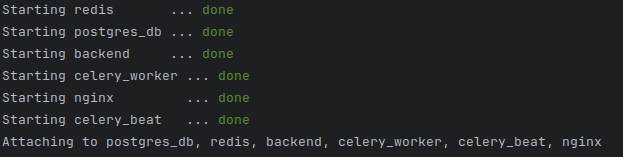
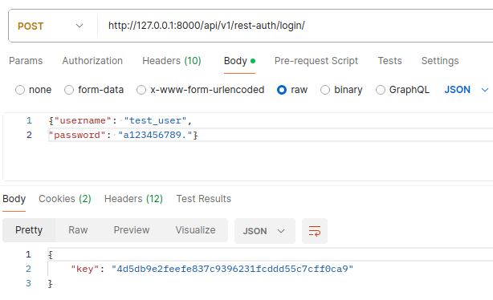
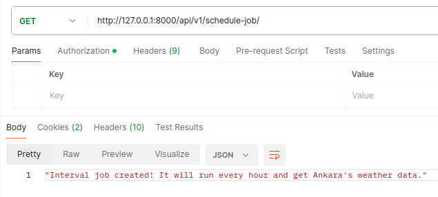
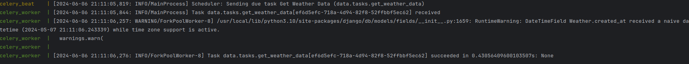
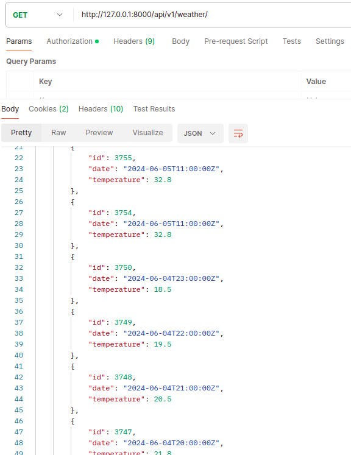
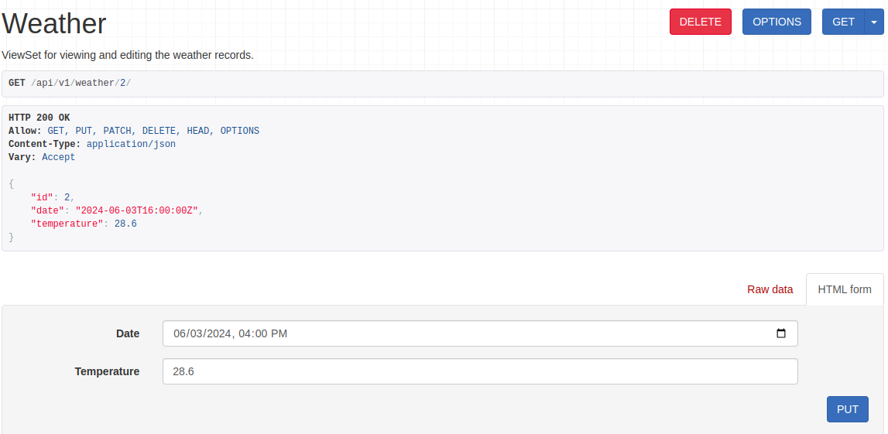
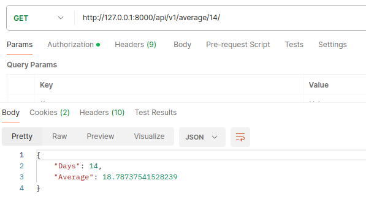
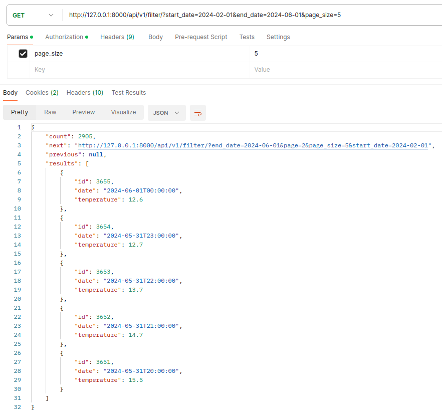
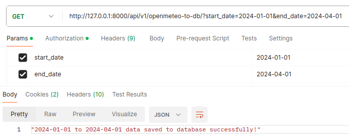
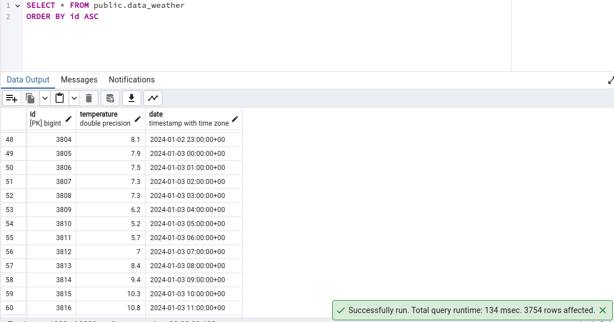

# WEATHER API

- Uygulama open-meteo api'sinden Ankara şehrinin sıcaklık verilerini zamanlı bir iş şeklinde saatlik alır ve veritabanına kaydeder, API kısmında verileri sorgulama, yeni veri ekleme, güncelleme, tarihe göre filtreleme, sayfalama gibi özellikler sunar. Detaylı Api dökümantasyonu aşağıdadır.

- Backend teknolojisi olarak Django Rest Framework kullanıldı.
- Zamanlı iş oluşturmak için Celery kullanildi.
- Celery Broker olarak Redis kullanıldı.
- Veritabanı olarak Postgresql kullanıldı.
- Nginx kullanildi.
- Teknolojiler birbirlerine olan bağımlılıklarına göre docker-compose file ile dockerize edildi. 

## Nasıl Çalıştırılır?

#### * Proje Ubuntu 20.04 dağıtımında, Python 3.10, Docker 26.1.0, docker-compose 1.25.0 versiyonlarında geliştirilmiştir.

- docker-compose.yml dosyasının bulunduğu dizinde aşağıdaki komutu çalıştırarak uygulamayı ayağa kaldırabilirsiniz.

  ```bash
  docker-compose up --build
  ```
  
- Uygulama ayağa kalktıktan sonra aşağıdaki komutu çalıştırarak uygulamanın çalışıp çalışmadığını kontrol edebilirsiniz.

  ```bash 
  curl http://0.0.0.0:8000/admin/
  ```
- Uygulama ayağa kalktıktan sonra DRF'te superuser oluşturmak için aşağıdaki komutu çalıştırabilirsiniz.

    ```bash
    docker-compose exec backend python manage.py createsuperuser
    ```

## API Dökümantasyonu

## - <span style="color:red">**_api/v1/rest-auth/login/_**</span>
(POST): Kullanıcı girişi yapmak için kullanılır. Kullanıcı adı ve şifre ile giriş yapılır.

  

## - <span style="color:red">**_api/v1/schedule-job/_**</span>
Zamanlı iş oluşturmak için  bu endpointe get isteği atmalısınız.

  
  

## - <span style="color:red">**_api/v1/weather/_**</span>
Tüm hava durumu verilerini getirir ve yeni veri eklemek için kullanılır. Sayfalama için default 10 ancak page_size parametresi ile sayfa boyutunu değiştirebilirsiniz.

  

## - <span style="color:red">**_api/v1/weather/id/_**</span>
Veritabanında bulunan verileri id'ye göre getirir, günceller ve siler.

  

## - <span style="color:red">**_api/v1/average/days/_**</span>
Belirli bir gün sayısına göre ortalama sıcaklık değerlerini getirir.

  
  
## - <span style="color:red">**_api/v1/filter/_**</span>
Belirli bir tarih aralığına göre sıcaklık değerlerini getirir.
start_date ve end_date parametrelerini göndermelisiniz.
Tarh formatı: YYYY-MM-DD, page_size parametresi ile sayfa boyutunu değiştirebilirsiniz.

  

## - <span style="color:red">**_api/v1/openmeteo-to-db/_**</span>
Open-meteo api'sinden toplu veri çekip veritabanına kaydetmek için kullanılır.
Tarih formatı: YYYY-MM-DD,
start_date ve end_date parametrelerini göndermelisiniz.
  
  
